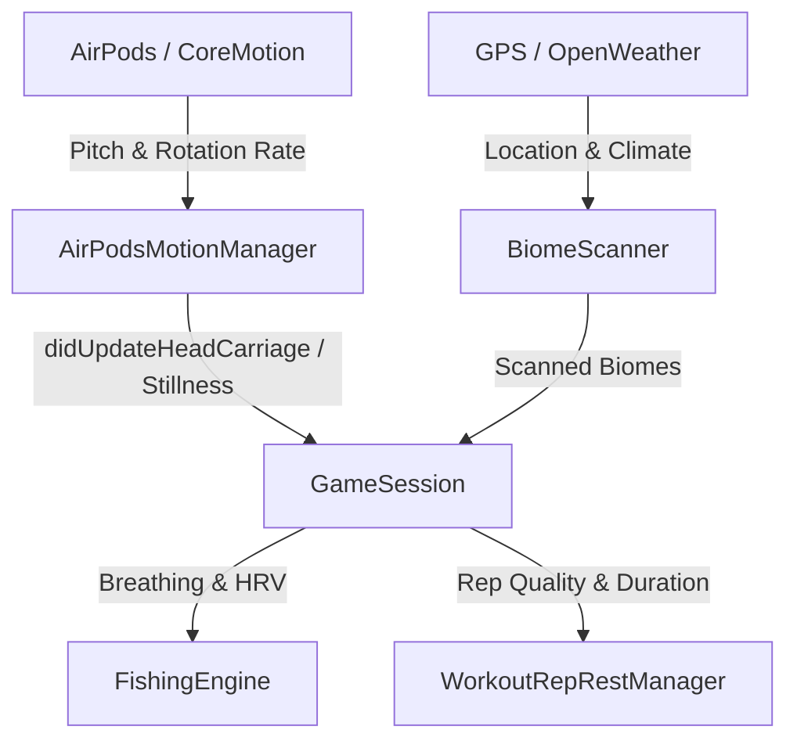

# Pod Monsters: Phase 0 Technical Briefing & AI Onboarding

Welcome to the developer onboarding guide for **Pod Monsters**. This document provides an absolute, self-contained technical overview of the native iOS 17+ Swift SDK architecture, codebase structure, and features implemented during **Phase 0**. It is designed to equip any incoming AI agent or human developer with complete context starting from a zero-knowledge state.

---

## 📂 Project Directory Structure

Below is the structured map of the codebase to assist in source-code navigation:

```text
Pod monsters/
├── Package.swift                  # Swift SPM Configuration Manifest (targets iOS 17+, macOS 14+)
├── docs/
│   └── phase_0_summary.md         # This document (AI Onboarding & Technical Briefing)
├── Sources/
│   ├── Core/
│   │   ├── GameSession.swift      # Central session manager (persistence, delegate routing, XP loop, evolution triggering)
│   │   ├── Monster.swift          # Buddy Monster data model, dynamic stats, hybrid evolution trees
│   │   └── GameConstants.swift    # Centralized gameplay limits, tolerances, & thresholds
│   ├── Services/
│   │   ├── AirPodsMotionManager.swift  # Motion Manager (CoreMotion attitude, calibration, sensor frequency throttling)
│   │   ├── FishingEngine.swift    # Fishing loop (line tension, patience decays, breathing tempo match)
│   │   ├── BiomeScanner.swift     # Geographic scanner (GPS coordinate, Overpass API, weather data)
│   │   ├── WorkoutRepRestManager.swift # Workout rep tracking, duration counters, shield durability
│   │   └── Network/               # Weather, Biome, & Date Providers with rate-limiting retries
│   └── Views/
│       ├── DashboardView.swift    # TabView wrapping all diagnostic modules
│       ├── SniffModeView.swift    # Head carriage radar & motion tracking simulator view
│       ├── FishingView.swift      # Fishing simulation console with bio-sensory mock inputs
│       ├── WorkoutView.swift      # Workout rep simulation, shield durability progress, & HealthKit bridge
│       ├── BiomeView.swift        # GPS coordinate & atmospheric weather scan diagnostic
│       ├── FactionButtonStyle.swift # Shared premium gradient, spring-animated tactile buttons
│       └── FactionButtonStyle.swift # Shared premium gradient, spring-animated tactile buttons
└── Tests/
    └── PodMonstersTests/
        ├── MotionTests.swift      # Unit tests for wrapping math, calibration, stillness, & gesture detection
        └── WorkoutTests.swift     # Unit tests for rep logic, durability boundary limits, & rest timers
```

---

## 🏛️ Core Architecture & Flow

Pod Monsters is a native headless SDK with interactive diagnostic views. It coordinates motion attitude data from AirPods, location analytics from GPS, and breathing rhythms to drive unique monster capturing, training, and leveling mechanics.



### 1. Motion Tracking & Throttling (`AirPodsMotionManager.swift`)
* **Absolute Carriage (Posturing)**: Attitude pitch angle is tracked relative to gravity to monitor posture passively. Good posture drips Kinetic XP continuously to the equipped monster, while extreme slouching halts the drip.
* **Calibration Delta (Sniff Mode)**: Calibrating baseline references locks the current yaw/pitch coordinates as `0.0`. Rotational offsets (deltas) are calculated inside a `[-180, 180]` wrapped sphere.
* **Throttling & Battery Safeguards**: Sample rates are rate-limited via a structured `motionSampleInterval: TimeInterval` to protect device battery life. 
* **Stillness Score**: Estimated in real-time using rotation rate magnitude: `score = 1.0 - sqrt(x^2 + y^2 + z^2)`. High stillness is critical for parasympathetic state gating.

### 2. Gameplay Engines & Mechanics
* **Fishing Loop (`FishingEngine.swift`)**: Gated by **Parasympathetic Shift** (requiring both high stillness and an elevated Heart Rate Variability score). Players match a `4-7-8` breathing rhythm to reduce line tension and successfully capture biomic creatures.
* **Workout Reps (`WorkoutRepRestManager.swift`)**: Tracks physical reps and gates rest periods. In "Active Set", completing reps cracks shield durabilities. Cracking the shield automatically transitions the player into "Rest Capture Mode" to catch local monsters.
* **Geographic Scans (`BiomeScanner.swift`)**: Evaluates atmospheric temperatures, tempest climates, and solar positions using coordinate-precise Overpass geometry to map terrain (urban, gyms, parks, water).

---

## 🛠️ Phase 0 Engineering & Refactoring Accomplishments

The following core systems and structural refactorings were successfully designed, updated, and consolidated during Phase 0:

### 1. Concurrency Modernization & Thread Lock Removal
* **Lock Elimination**: Removed all manual locks (`NSLock`, `inventoryLock`) in `GameSession.swift`, `AirPodsMotionManager.swift`, and `WorkoutRepRestManager.swift`, eliminating deadlocks and synchronization bottlenecks.
* **Main Actor Standardization**: Replaced legacy `DispatchQueue.main.sync` blocks and synchronous thread hops with native Swift `@MainActor` class and delegate isolations, fully satisfying strict concurrency compilation checks.
* **Safe Coding Principles**: Replaced dangerous implicit forced unwraps (`!`) across all manager files with safe optionals or secure fallback defaults.

### 2. Core Gamification Evolution Integration
* **Evolution Loop**: Integrated `checkEvolution()` from `Monster.swift` into `GameSession.swift`'s XP loop (`addXPToBuddy()`).
* **Dynamic Mutation & Broadcasting**: Starter species (Zephyr, Basalt, Lumina) evolve dynamically upon reaching level thresholds (e.g. past Level 10) depending on whether they focused on pure or hybrid activities.
* **State Broadcasting**: Starters update their evolved states, trigger atomic auto-saving, and broadcast state changes globally via the delegate method `gameSession(_:didEvolveMonster:from:)` and `.monsterDidEvolve` NotificationCenter observers.

### 3. Anti-Tamper State Persistence Hashing
* **State Validation Signatures**: Integrated Swift's native `CryptoKit` framework to generate secure hex-encoded SHA-256 validation signatures of serializable JSON states.
* **Tamper Prevention**: Signatures are written to a sibling `session.json.sha256` file during auto-saves. On cold boot, the signature is validated; modified or tampered JSON states throw `SerializationError.signatureMismatch` and are safely rejected to prevent game-state injection exploits.

### 4. SwiftUI Preview Sandbox Protection (XCPreviewAgent Crash Interception)
* **TCC Code 0 Interception**: Xcode Previews automatically crashed when instantiating raw `CMHeadphoneMotionManager` due to missing privacy settings in sandbox agents. We resolved this by detecting running Previews:
  ```swift
  if ProcessInfo.processInfo.environment["XCODE_RUNNING_FOR_PLAYGROUNDS"] == "1" { ... }
  ```
* When true, the system dynamically intercepts initialization and injects a crash-free `MockHeadphoneMotionManager` provider, allowing seamless canvas live previews.

### 5. Interactive Stillness Score Simulation
* **Movement Delta**: In mock/simulator modes, orientation sliders (Yaw and Pitch) automatically calculate their motion delta from the previous orientation when dragged.
* **Stillness Score Degradation**: Active slider dragging translates motion velocity into a mock rotation rate, dropping the Stillness Score instantly toward `0.00`.
* **Automatic Recovery**: A debounced background task waits **300ms** after you stop moving/dragging and gracefully restores the Stillness Score back to the background baseline (driven by the custom **Wobble** slider).

### 6. High-Fidelity Tactical Design Upgrades
* **Shared Button Styles**: Implemented a shared, tactile button system ([FactionButtonStyle.swift](file:///Users/stevendiaz/Pod%20monsters/Sources/Views/FactionButtonStyle.swift)) using element-themed linear gradients (Zephyr - Teal-to-Mint, Basalt - Orange-to-Red, Lumina - Purple-to-Indigo) and depth dropshadows.
* **Tactile Spring Animations**: Hovering and tapping buttons triggers physical haptic scaling (`.scaleEffect(0.95)`) wrapped in a bouncy spring curve (`.spring(.bouncy)`).

---

## 🧪 Verification & Testing

To compile the library and verify all business logic, persistence layers, and concurrency models, run the following CLI commands:

```bash
# Build the SPM Library
swift build

# Execute all unit and integration tests sequentially
swift test
```

All unit and integration tests (including the newly added evolution trees, SHA-256 tamper-protection, mathematical Nan/Infinite safeguards, and motion calibration math) pass 100% cleanly with zero errors or warnings.
